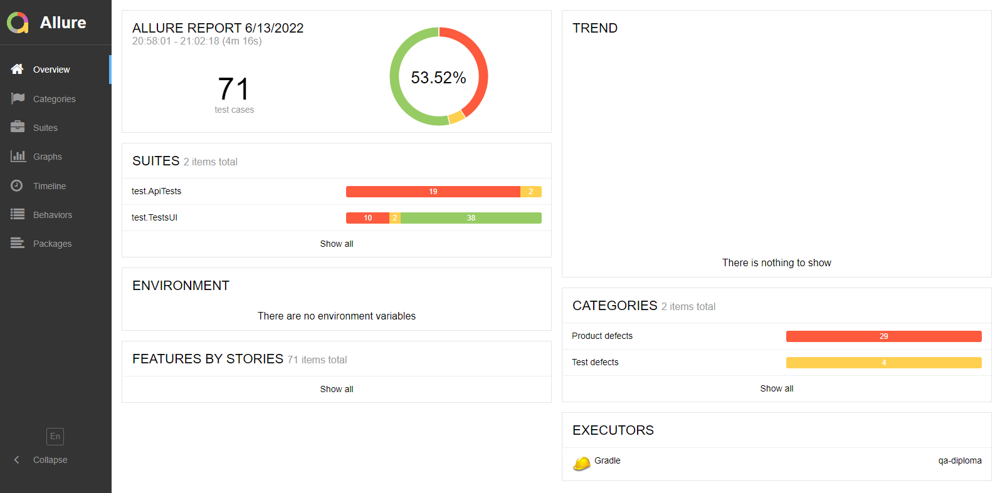

# Отчёт о проведённой автоматизации

## Запланировано/Сделано

Запланировано:
1. Автоматизировать позитивные и негативные UI сценарии тестирования сервисов покупки туров ("Оплата по карте" и "Кредит по данным карты").
2. Автоматизировать тестирование API
3. Реализовать поддержку БД MySQL и PostgeSQL

Все три пункта выполнено

## Сработавшие риски
Из-за отсутствия ТЗ и какой-либо документации сложно судить, насколько корректно были выбраны сценарии для написания автотестов

## Затрачено времени

- Разработка плана тестирования - 16 часов;
- Подготовка необходимых инструментов, написание кода автотестов - 80 часов;
- Подготовка отчетной документации, баг-репортов, issues - 16 часов;

довольно много времени ушло на то, чтобы разобраться, как необходимо запускать приложение и как нужно передавать параметры при запуске приложения и при запуске автотестов.

### Количество тест-кейсов

Общее количество тест-кейсов UI -  50 (4 позитивных, 46 негативных)

* успешных - 40 (80%)
* неуспешных - 10 (20%)

Общее количество тест-кейсов API - 21

